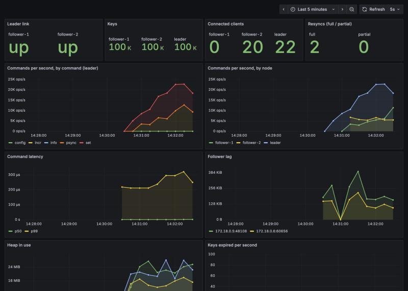

# Respite

A replicated, Redis-compatible key-value store written from scratch in Go, with no dependencies beyond the standard library.

It speaks Redis' wire protocol (RESP2 and RESP3), so the official `redis-cli` and `redis-benchmark`, and client libraries such as [go-redis](https://github.com/redis/go-redis) and [redis-py](https://github.com/redis/redis-py), work against it unchanged. It supports strings, counters, sorted sets, key expiry, pub/sub, append-only-file persistence, leader–follower replication and Prometheus metrics.

```console
$ docker compose up -d --build      # a leader, two followers, Prometheus and Grafana

$ redis-cli -p 6379 ZADD leaderboard 300 carol 100 alice 200 bob
(integer) 3
$ redis-cli -p 6380 ZREVRANGE leaderboard 0 1 WITHSCORES     # read from a follower
1) "carol"
2) "300"
3) "bob"
4) "200"
$ redis-cli -p 6380 SET x 1
(error) READONLY You can't write against a read only replica.
```



## What it supports

| Area | Commands |
|---|---|
| Strings | `GET` `SET` (with `NX` `XX` `EX` `PX` `EXAT` `PXAT` `KEEPTTL`) `MGET` `MSET` `DEL` `EXISTS` `TYPE` |
| Counters | `INCR` `DECR` `INCRBY` `DECRBY` (overflow-checked) |
| Sorted sets | `ZADD` (with `NX` `XX` `CH`) `ZINCRBY` `ZREM` `ZSCORE` `ZCARD` `ZRANK` `ZREVRANK` `ZRANGE` `ZREVRANGE` `ZRANGEBYSCORE` (with `LIMIT`) `ZCOUNT` |
| Expiry | `EXPIRE` `PEXPIRE` `EXPIREAT` `PEXPIREAT` `TTL` `PTTL` `PERSIST` |
| Keyspace | `KEYS` (Redis glob patterns) `DBSIZE` `FLUSHALL` |
| Pub/sub | `SUBSCRIBE` `UNSUBSCRIBE` `PUBLISH` |
| Replication | `-replicaof host:port`, `PSYNC`, `INFO` replication section |
| Connection | `HELLO` (RESP2 / RESP3) `CLIENT ID` `CLIENT SETNAME` `CLIENT GETNAME` `CLIENT SETINFO` `PING` `ECHO` `QUIT` |
| Server | `INFO` `CONFIG GET`, Prometheus `/metrics` |

## Architecture

```
            TCP connection (one goroutine each)
                          │
   resp.Reader ──► dispatch ──► command handler ──► store.Store (map + RWMutex)
                                        │                 └── zset.ZSet (map + skip list)
                                        │
                                        ├──► propagate ──► aof.AOF (append-only log)
                                        │                └► replication backlog ──► followers
                                        └──► broker (pub/sub channels)
                          │
   resp.Writer ◄── replies buffered, flushed once per pipelined batch
```

| Package | Responsibility |
|---|---|
| [`internal/resp`](internal/resp) | Parses RESP and the inline form used by `nc`/`telnet`; writes RESP2 or RESP3 replies |
| [`internal/store`](internal/store) | The keyspace: a map behind a read/write lock, typed values, lazy and active expiry, a glob matcher |
| [`internal/zset`](internal/zset) | Sorted sets: a hash map plus a skip list with spans for O(log n) rank queries |
| [`internal/aof`](internal/aof) | Append-only-file persistence: group commit, fsync policies, crash-safe replay |
| [`internal/server`](internal/server) | Connections, command table, pipelining, pub/sub, replication, metrics, graceful shutdown |

## Design decisions

**Goroutine per connection, shared store behind a `sync.RWMutex`.** Real Redis runs every command on one thread. Here, reads can run in parallel on every CPU core, while writes take turns. The benchmarks below show the effect of that trade-off.

**RESP2 and RESP3.** Current client libraries open every connection with `HELLO 3`, asking for RESP3, a newer version of the protocol with a real null, maps, doubles and "push" messages.
- redis-py won't connect to a server that refuses `HELLO`, so supporting only RESP2 wasn't enough.
- Each connection's reply writer knows which version it speaks. The handful of replies that differ fall back automatically: in RESP2 a map is written as a flat array and a double as a string. So command handlers don't care which version a client uses.
- Those differing replies are nulls, sorted-set scores, `WITHSCORES` pairs, pub/sub messages and `CONFIG GET`.
- Tests compare the exact bytes of both encodings.

**Untrusted input.** Every length in the protocol comes from the client, so the parser never allocates based on one. It grows buffers as data actually arrives: otherwise a client could send just `$536870912` and make the server reserve 512 MB. A fuzz test has fed the parser over 13 million random inputs without a crash, and checks that everything it accepts survives being re-encoded.

**Pipelining.** A client can send many commands without waiting for replies. The server keeps executing while the reader still has buffered input, and only then flushes all the replies in one `write` system call. At 16 commands per batch, throughput goes up roughly 6–12× (see the benchmarks).

**Expiry, done the Redis way.** A key with an expiry time in the past is hidden immediately on read (*lazy* expiry). Ten times a second a background sweep samples 20 keys that have a TTL and deletes the expired ones. It repeats while more than 25% of a sample had expired (*active* expiry). Memory is reclaimed without scanning the whole keyspace or holding the lock for long.

**Sorted sets on a skip list.** Each sorted set is two structures holding the same data: a hash map from member to score for O(1) `ZSCORE`, and a skip list ordered by (score, member) for ranges. Every link in the skip list stores its *span*, the number of elements it jumps over. Adding up spans along a search path gives an element's rank in O(log n), so `ZRANK` and `ZRANGE` by index never walk the list. A randomized test checks the skip list against a plain sorted slice after each of 5,000 random inserts and deletes.

**Persistence with an append-only file.** Every write is appended to a log in RESP format and replayed on startup.
- *The effect is logged, not the request.* `SET k v EX 60` is logged as `SET k v PXAT <unix-ms>`, otherwise a restart a day later would give the key a fresh 60 seconds. `ZINCRBY` is logged as a `ZADD` of the resulting score, and a `SET … NX` that didn't set anything isn't logged at all.
- *Log order is apply order.* Write commands hold one lock from the moment they change the store until their entry is in the log. Without it, two clients setting the same key at once could be applied in one order and logged in the other, and a restart would bring back the wrong value. A regression test forces that race; it fails 9 runs out of 10 without the lock.
- *Group commit.* Commands are buffered and written out before replies are sent. A client is never told `OK` for a write that hasn't reached the OS, and one `write` call covers the whole batch.
- *fsync policy* (`always` / `everysec` / `no`) trades durability against speed, as in Redis.
- *Crash-safe replay.* A crash in the middle of a write leaves a half-written command at the end of the file. On startup that tail is detected and truncated. Corruption anywhere else refuses to start, because starting with silently missing data would be worse.

**Only the leader decides when keys expire.** Whenever the leader deletes an expired key, by sweep or because a write found it expired, it logs a `DEL`. During AOF replay, and on followers, keys are never expired locally; they wait for that `DEL`, and reads simply hide expired keys. Without this rule, replaying `INCR k` after `k`'s TTL had passed recreated it as `1` with no expiry, a key that should have gone and never would. A follower whose clock runs behind the leader's would have diverged the same way. This mirrors how Redis replicas handle expiry.

**Replication.**
- *The stream.* A follower receives the same RESP stream the leader writes to its AOF.
- *Handshake.* On connecting, the follower sends `PSYNC <replication id> <offset>`.
  - A new follower, or one that has fallen too far behind, gets a *full resync*: a snapshot of the whole dataset as commands, then the live stream.
  - A follower that only lost its connection briefly gets a *partial resync*: it catches up from a 1 MiB ring buffer of the most recent stream (the backlog) without copying everything again.
- *Lag tracking.* Followers apply commands in order, reject client writes with `READONLY`, and acknowledge their offset every second, so the leader can report each follower's lag in bytes.
- *Asynchronous.* The leader replies before followers have the write, so a follower can briefly serve stale reads.
- *Snapshot pause.* Redis builds its snapshot in a forked child process while the parent keeps taking writes (copy-on-write). Go can't fork, so writes pause while the snapshot is built in memory. Reads carry on.

**Pub/sub without letting slow subscribers block publishers.** Each subscriber has a bounded message queue drained by its own goroutine. `PUBLISH` never waits: if a subscriber's queue is full, that subscriber is disconnected, as Redis does with `client-output-buffer-limit`. Followers that fall out of the backlog are dropped the same way and come back with a full resync.

**Observability.** `-metrics :9121` serves Prometheus metrics, written by hand in the text exposition format:
- commands per second by command
- a command-latency histogram
- connected clients
- keys, and keys expired
- follower lag in bytes
- full and partial resyncs
- heap size

The counters are atomic, and benchmarking with them switched off showed no measurable difference. The Compose setup provisions Grafana with the dashboard above.

## Benchmarks

`redis-benchmark` against Redis 8.10 and Respite on the same machine (Apple M2): 500,000 requests, 50 clients, 100,000 random keys. Run with `make bench`; full output in [bench/results.md](bench/results.md). Writes vary by up to ±25% between runs on a laptop, reads by about ±10%, so treat these as rough.

**No persistence**

| Command | Pipeline | Redis ops/s | Respite ops/s | Respite vs Redis |
|---|---|---|---|---|
| SET | 1 | 109,051 | 119,932 | 110% |
| GET | 1 | 115,580 | 122,729 | 106% |
| INCR | 1 | 125,722 | 123,304 | 98% |
| SET | 16 | 912,408 | 837,520 | 92% |
| GET | 16 | 1,048,218 | 1,497,006 | 143% |
| INCR | 16 | 1,184,834 | 786,163 | 66% |

**With AOF, fsync every second**

| Command | Pipeline | Redis ops/s | Respite ops/s | Respite vs Redis |
|---|---|---|---|---|
| SET | 16 | 715,307 | 627,352 | 88% |
| GET | 16 | 1,103,752 | 1,628,664 | 148% |
| INCR | 16 | 796,178 | 578,034 | 73% |

**What the numbers mean.**
- Reads are faster than Redis because `GET`s take a shared read lock and run on every core at once.
- Pipelined writes are slower because they all queue behind one lock, so extra cores stop helping. That lock now also covers logging each write, which costs some throughput in exchange for the log always matching what was applied. Real Redis does all of this on a single core with no locks at all.
- Throughput per CPU core, Redis is far more efficient. Respite uses several cores to reach these numbers, while Redis uses one.
- p99 latency is also worse for Respite on writes, because some requests wait on the lock.

## Running it

Install the binary with Go 1.22 or later:

```bash
go install github.com/Prem1706/respite/cmd/respite@latest
respite -metrics :9121
```

Or from a clone:

```bash
make test     # all tests with the race detector
make run      # a single server on :6379, persisting to appendonly.aof
make cluster  # leader on :6379, followers on :6380 and :6381, Grafana on :3000
make bench    # needs redis-server and redis-benchmark (brew install redis)
```

Flags:

| Flag | Meaning |
|---|---|
| `-addr :6379` | Address to listen on |
| `-aof appendonly.aof` | AOF path; `-aof ""` disables persistence |
| `-appendfsync always\|everysec\|no` | When to fsync the AOF |
| `-replicaof host:port` | Run as a read-only follower of that leader |
| `-metrics :9121` | Serve Prometheus metrics at `/metrics` |

## Testing

- **Real clients.** go-redis v9 and redis-py 8 were run against a leader and a follower, both locally and in the Docker cluster, in both RESP2 and RESP3 mode. They cover strings, TTLs, sorted sets, pipelines, pub/sub, `WRONGTYPE` errors, reading from the follower and its `READONLY` error. Every check passed.
- **Crash test.** A test builds the real binary, sends `INCR`s, kills the process with `SIGKILL` mid-stream, and restarts it. Under both fsync policies, every acknowledged write must survive. Removing the AOF flush before replies makes it fail, losing about 1,000 acknowledged writes.
- **Fuzzing.** `FuzzReadCommand` throws random bytes at the parser; CI runs it for 30 seconds on every push.
- **Unit tests** cover:
  - the parser: binary-safe values, truncated input, malformed input
  - the store: expiry with a fake clock, passive expiry, overflow, wrong-type errors, 50 goroutines × 200 concurrent `INCR`s losing no updates
  - the skip list: checked against a sorted slice after 5,000 random operations
  - the AOF: replay, truncated-tail recovery, refusing corruption
- **End-to-end tests** start real servers on random ports and talk to them over TCP. They cover:
  - pipelining, pub/sub, and every sorted-set command
  - restarting from the AOF, including the two ordering and expiry bugs above
  - replication: full sync, live streaming, read-only followers, partial resync after a dropped connection, full resync after the backlog is overwritten, a leader restart, and expiry with the follower's clock 10 seconds behind
- Everything runs under `go test -race` in CI, and CI also builds the Docker image.

## Limitations and next steps

- **Sharded locking.** Split the keyspace into N shards by key hash, each with its own lock, so writes to different keys stop contending. Writes would then also need ordering per shard in the log.
- **AOF rewrite.** The log grows forever. `Store.Dump`, which already builds the snapshot for new followers, could also rewrite the AOF as the smallest set of commands that rebuilds the current data.
- **Failover.** If the leader dies, a follower has to be promoted by hand. Automatic failover needs leader election, as in Redis Sentinel or Raft.
- **Followers forget their position on restart.** A restarted follower always does a full resync, because it doesn't save the leader's replication id and offset to disk.
- **Interoperability.** Respite followers can only follow a Respite leader: the snapshot is a list of commands, not Redis' RDB format.
- Lists, hashes and sets are not implemented, and there is one database, no auth, no transactions and no client-side caching (the RESP3 feature where the server tells clients when cached keys change).
